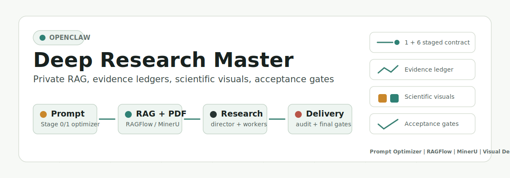

# OpenClaw Deep Research Master



OpenClaw Deep Research Master is a production-oriented deep research workflow package for OpenClaw. It turns a rough research request into a clarified task, aligns it with private reference knowledge, plans multi-lane research, executes source-gathering workers, audits the result, and produces a final business-ready deliverable with evidence, visual assets, progress reporting, and release gates.

中文说明见 [README.zh-CN.md](README.zh-CN.md)。

> This repository is an OpenClaw workspace/project package. It is not a standalone SaaS product, Python package, or Node package. You need an OpenClaw runtime and your own model/search/RAG/visual tool configuration.

## What It Does

- **Stage 0/1 prompt optimization**: compiles the user's raw research topic into a structured task prompt before clarification, using `scripts/optimize-intake-prompt.sh` and `scripts/prepare-clarification-dispatch.sh`.
- **1 + 6 agent workflow**: master controller, clarification, knowledge alignment, director, worker, audit, and final delivery roles.
- **Private knowledge alignment**: supports local RAGFlow datasets/vector indexes for business reference and writing-style reference libraries.
- **Search routing and evidence discipline**: routes AnySearch/Tavily/web-fetch work, records source discovery, extraction, checkpoints, and evidence ledger artifacts.
- **Scientific/business visuals**: uses `deep-research-visuals`, `nature-figure`, draw.io, Mermaid, PlantUML, Graphviz, Manim, Python Diagrams, Schemdraw, and Bioicons where appropriate.
- **PDF-heavy reference ingestion**: expects MinerU-backed parsing when RAGFlow sync handles PDFs.
- **Progress and fallback monitoring**: lifecycle-gated progress reports, stage reports, model fallback alerts, stable idempotency keys, and completed-run cron shutdown.
- **Commercial release gates**: contract tests, runtime doctor, heartbeat smoke, local runtime smoke, acceptance gate, Obsidian sync checks, and portable packaging checks.

## Reference Projects And Positioning

This project references the broader open-source deep-research and agent-coordination ecosystem, especially:

- [HKUDS/ClawTeam](https://github.com/HKUDS/ClawTeam): a multi-agent coordination framework for CLI agents such as Claude Code, Codex, OpenClaw, and custom terminal-native agents. Its emphasis is agent spawning, coordination, worktree isolation, status reporting, and team execution infrastructure.
- [HKUDS/Auto-Deep-Research](https://github.com/HKUDS/Auto-Deep-Research): an open-source, cost-efficient automated deep-research assistant based on the AutoAgent framework. Its emphasis is ready-to-use autonomous research, web/source exploration, file support, multi-model compatibility, and report synthesis.

Naming note: [karpathy/autoresearch](https://github.com/karpathy/autoresearch) is a thought-adjacent autonomous ML experimentation loop for single-GPU nanochat training. It is not the `Auto-Deep-Research` project referenced above, and it is not a direct dependency of this OpenClaw package. In this repository, `Auto-Deep-Research` means `HKUDS/Auto-Deep-Research` unless explicitly stated otherwise.

OpenClaw Deep Research Master is different in scope. It is not a general multi-agent framework and not a zero-configuration research app. It is an OpenClaw workspace package for commercial research delivery, with a fixed 1 + 6 staged contract, Stage 0/1 Prompt Optimizer, RAGFlow/MinerU private-reference alignment, search-route and evidence ledgers, lifecycle-gated progress reports, Obsidian sync, scientific/business visual routing, and acceptance gates before final delivery.

Its main advantage is operational delivery quality: it turns deep research into a repeatable, auditable, private-knowledge-aware, visual-deliverable-ready business workflow. ClawTeam and Auto-Deep-Research are upstream inspirations and useful reference projects; this repository focuses on the OpenClaw production workflow layer built around them.

## Default Model Chain

The production baseline was validated with:

- Primary: `moonshot/kimi-k2.6`
- CodePlan fallback: `openai/gpt-5.5`
- Local summary fallback: `local-summary/qwen3.5-9b-q8`

If you use another primary model, adjust:

- OpenClaw account/model routing for each agent.
- Cron payload model/fallback settings in your OpenClaw cron jobs.
- `scripts/deep-research-runtime-doctor.sh` expectations if your deployment names differ.
- Stage prompts and validation thresholds if the replacement model is weaker at long-context planning, evidence discipline, or Chinese business writing.

After changing models, rerun:

```bash
zsh tests/test-contracts.sh
zsh scripts/v1-release-check.sh
zsh scripts/local-runtime-smoke.sh
```

## Requirements

Minimum command-line tools:

- `zsh`, `jq`, `rg`, `curl`, `git`
- OpenClaw runtime with the project workspace installed
- model credentials/config for your chosen model chain
- AnySearch and/or Tavily/web search configuration
- RAGFlow for local reference datasets and vector retrieval
- MinerU API for robust PDF parsing in RAGFlow sync
- Obsidian vault path if you want final deliverable sync

Visual/tooling requirements for full output quality:

- `deep-research-visuals` skill
- `nature-figure` skill
- draw.io CLI (`drawio`)
- Mermaid CLI (`mmdc`)
- PlantUML (`plantuml`)
- Graphviz (`dot`)
- Manim (`manim`)
- Python environment with scientific plotting packages, `diagrams`, `schemdraw`, and `bioicons`

See [docs/DEPENDENCIES.md](docs/DEPENDENCIES.md) for the full matrix.

## Quick Start

1. Install or prepare OpenClaw.
2. Copy this repository into an OpenClaw workspace, commonly:

   ```bash
   $HOME/.openclaw/workspace-deep-research-master
   ```

3. Run the bash-compatible setup wizard. It does not use `sudo`; the installer can run under bash, but the core workflow scripts still require `zsh`.

   ```bash
   bash scripts/install-config-wizard.sh --mode cloud
   # or:
   bash scripts/install-config-wizard.sh --mode local
   ```

   The wizard prompts for AnySearch/Tavily API keys, RAGFlow/MinerU settings, business-reference and style-reference folders or `REMOTE_ONLY`, dataset IDs, and model-service settings.

4. If you prefer manual setup, copy local config examples:

   ```bash
   cp deep-research/config/runtime.local.example.env deep-research/config/runtime.local.env
   cp deep-research/config/ragflow.local.example.env deep-research/config/ragflow.local.env
   cp deep-research/config/ragflow_folder_mappings.example.json deep-research/config/ragflow_folder_mappings.json
   ```

5. Fill in your local paths, dataset IDs, model/search credentials, and Obsidian vault settings. Do not commit private config files.
6. Run the release gate:

   ```bash
   zsh scripts/v1-release-check.sh
   ```

7. On an operator machine, run live smoke:

   ```bash
   zsh scripts/local-runtime-smoke.sh
   ```

See [docs/INSTALLATION.md](docs/INSTALLATION.md) for cloud OpenClaw, no-sudo, `REMOTE_ONLY`, vector database, MinerU, and weaker-model setup guidance.

## Validation Status

The commercial baseline was validated on 2026-06-02 with:

- `tests/test-contracts.sh`: `PASS 33/33`
- `scripts/v1-release-check.sh`: `PASS`
- non-git distribution release gate: `PASS`
- `scripts/local-runtime-smoke.sh`: `PASS 11 checks`

## Repository Safety

The package intentionally excludes:

- `deep-research/runs/`
- `deep-research/reports/`
- `.openclaw/`
- `.progress_report_log.json`
- `.fallback_alert_log.json`
- `.stage_report_outbox/`
- private files under `deep-research/config/`

Private configs must stay local. Example files are provided for public documentation and setup.

## Feedback And Contributions

This project is open-sourced as a working OpenClaw engineering baseline, and it will be more useful if other users try it in their own runtime environments.

You are welcome to:

- use it as an OpenClaw deep-research workflow template;
- open issues with setup problems, model-routing differences, RAGFlow/MinerU parsing problems, visual toolchain failures, or stage-contract gaps;
- suggest improvements to prompts, contracts, search routing, evidence tracking, progress reporting, acceptance gates, or scientific/business visual generation;
- contribute pull requests for new backends, new skills, better documentation, portability fixes, and reproducible test cases;
- fork and adapt it for your own organization, while keeping private configs and local data out of public repositories.

See [CONTRIBUTING.md](CONTRIBUTING.md) for the preferred issue and pull-request format.

## License

MIT. See [LICENSE](LICENSE).
